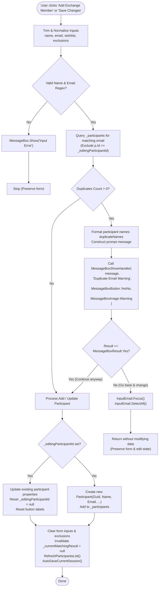

# Architectural Blueprint: Duplicate Email Allowance with Confirmation Warning

**Prepared by:** `xp-architect` (Lead Systems Architect)  
**Status:** Approved by Human (Phase 1 Checkpoint)

---

## 1. Executive Summary & Problem Statement

### 1.1 Context & Real-World Use Case
In community, family, and workplace Secret Santa gift exchanges, multiple participants frequently share an email address:
- Parents managing gift exchanges on behalf of children or young dependents.
- Couples or households operating out of a single joint inbox.
- Group coordinators assisting participants who lack individual email access.

### 1.2 The Problem
In the current implementation of `MainWindow.xaml.cs` (lines 323–328):
```csharp
if (_participants.Any(p => (string.IsNullOrEmpty(_editingParticipantId) || p.Id != _editingParticipantId) && p.Email.Equals(email, StringComparison.OrdinalIgnoreCase)))
{
    MessageBox.Show("This email address has already been added.", "Duplicate Error", MessageBoxButton.OK, MessageBoxImage.Error);
    return;
}
```
1. **Hard Blocker**: It completely prohibits adding or updating any participant sharing an email address.
2. **Opaque Feedback**: It does not indicate *which* participant already possesses that email address.
3. **Bypassed Test Seam**: It calls the static `MessageBox.Show` directly rather than routing through the configurable delegate `MessageBoxShowHandler`, hindering headless automated testing.

### 1.3 Proposed Solution
- Upgrade the duplicate email check from a blocking error into an **interactive confirmation warning**.
- Inspect existing participants using case- and whitespace-insensitive comparison, excluding the participant currently in edit mode.
- If matches are found, display a clear warning via `MessageBoxShowHandler` that cites the email address and enumerates all existing participants attached to it.
- Present a choice:
  - **Continue anyway (`MessageBoxResult.Yes`)**: Add or update the participant and proceed normally.
  - **Go back and change it (`MessageBoxResult.No`)**: Abort the submission while keeping all entered form data intact and refocusing the email input box.

---

## 2. Component Boundaries & Impact Analysis



### Component Analysis:
1. **Presentation / UI (`MainWindow.xaml.cs`)** — **[MODIFIED]**:
   - Location: `AddParticipant_Click` (lines 323–328).
   - Locates all participants with matching normalized email (excluding `_editingParticipantId`).
   - Uses `MessageBoxShowHandler` (`Func<string, string, MessageBoxButton, MessageBoxImage, MessageBoxResult>`).
   - Retains input fields on `MessageBoxResult.No` and focuses `InputEmail`.
   - Completes addition/edit on `MessageBoxResult.Yes`.
2. **Domain Models (`Models/Participant.cs`)** — **[ZERO IMPACT]**:
   - Identity is governed by `Participant.Id = Guid.NewGuid().ToString()`.
   - `DisplayName` property provides clean fallback if a participant name is whitespace.
3. **Solver Engine (`Services/MatchingSolver.cs`)** — **[ZERO IMPACT]**:
   - Constraint checks evaluate `giver.Id` and `receiver.Id`.
   - Duplicate email presence does not alter graph permutation or matching constraints.
4. **Email Dispatcher (`Services/EmailSender.cs`)** — **[ZERO IMPACT]**:
   - Dispatches separate personalized emails with individual token replacements (`{Giver}`, `{Receiver}`, `{Wishlist}`) to the shared inbox.
5. **Session Serialization (`Services/SessionManager.cs`)** — **[ZERO IMPACT]**:
   - Serialization to/from JSON natively supports identical email strings.

---

## 3. Dialog Phrasing & UI Interaction Specifications

### 3.1 Dialog Attributes
- **Caller Delegate**: `MessageBoxShowHandler`
- **Title**: `"Duplicate Email Warning"`
- **Button Type**: `MessageBoxButton.YesNo`
- **Image Icon**: `MessageBoxImage.Warning`

### 3.2 Content Formatting
```csharp
var duplicates = _participants
    .Where(p => (string.IsNullOrEmpty(_editingParticipantId) || p.Id != _editingParticipantId)
                && p.Email.Equals(email, StringComparison.OrdinalIgnoreCase))
    .ToList();

if (duplicates.Count > 0)
{
    string duplicateNames = string.Join(", ", duplicates.Select(p => $"'{p.DisplayName}'"));
    string message = $"The email address '{email}' is already registered to {duplicateNames}.\n\nDo you want to continue anyway, or go back and change it?";
    
    var dialogResult = MessageBoxShowHandler(message, "Duplicate Email Warning", MessageBoxButton.YesNo, MessageBoxImage.Warning);
    if (dialogResult != MessageBoxResult.Yes)
    {
        InputEmail.Focus();
        InputEmail.SelectAll();
        return;
    }
}
```

### 3.3 Button Outcomes
| Outcome | User Intent | Actions Taken |
|---|---|---|
| **`MessageBoxResult.Yes`** | *Continue anyway* | • In Add Mode: adds `Participant` to `_participants`.<br>• In Edit Mode: updates target participant.<br>• Resets inputs, clears `_formExclusions`, resets `_editingParticipantId`.<br>• Invalidates matches (`_currentMatchingResult = null`).<br>• Calls `RefreshParticipantsList()` and `AutoSaveCurrentSession()`. |
| **`MessageBoxResult.No`** | *Go back and change it* | • Aborts addition/update immediately (`return;`).<br>• Leaves `InputName`, `InputEmail`, `InputWishlist`, and `_formExclusions` completely untouched.<br>• If in Edit Mode, retains `_editingParticipantId` and keeps `SubmitParticipantBtn.Content = "Save Changes"`.<br>• Focuses `InputEmail` with `InputEmail.SelectAll()` for instant correction. |

---

## 4. Automated Test Strategy (xUnit)
All tests will be added in `SecretSantaMatcher.Tests/StateAndUiTransitionTests.cs` using `RunInSTA` and `SetMessageBoxShowHandler`:
1. `AddParticipant_DuplicateEmail_UserSelectsNo_AbortsAndPreservesForm`
2. `AddParticipant_DuplicateEmail_UserSelectsYes_AddsParticipantSuccessfully`
3. `AddParticipant_MultipleDuplicates_DialogListsAllParticipants`
4. `EditParticipant_DuplicateEmail_UserSelectsNo_PreservesEditState`
5. `EditParticipant_DuplicateEmail_UserSelectsYes_UpdatesParticipant`
6. `EditParticipant_UnchangedEmail_DoesNotTriggerWarning`
7. `AddParticipant_DuplicateEmail_CaseAndWhitespaceInsensitive`
