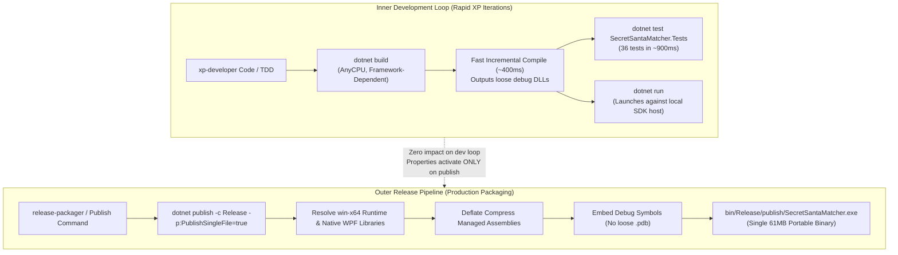

# Architectural Blueprint: Standalone Single-File Executable Packaging (Option A)

**Prepared by:** `xp-architect` (Lead Systems Architect)  
**Status:** Proposed (Awaiting Phase 1 Human Checkpoint Approval)  
**Date:** 2026-09-13  
**Target Application:** SecretSantaMatcher (.NET 10.0-windows, WPF)  

---

## 1. Context & Motivation

### 1.1 Current State & Pain Points
The current release packaging pipeline runs:
```powershell
dotnet publish SecretSantaMatcher.csproj -c Release -o bin/Release/publish
```
By default, this produces a multi-file, framework-dependent output directory:
- `SecretSantaMatcher.exe` (~160 KB apphost shim executable)
- `SecretSantaMatcher.dll` (Core application IL assembly)
- `SecretSantaMatcher.runtimeconfig.json` (CLR runtime configuration specifying .NET 10)
- `SecretSantaMatcher.deps.json` (Dependency graph manifest)
- `SecretSantaMatcher.pdb` (Debug symbol database)

This multi-file output suffers from major distribution challenges:
1. **Prerequisite Friction (.NET Runtime Missing)**: End users must have the matching .NET 10 Desktop Runtime pre-installed. If absent, launching `SecretSantaMatcher.exe` aborts with a missing runtime prompt.
2. **Separation & Accidental File Breakage**: When casual users copy `SecretSantaMatcher.exe` to their Desktop or share it without the adjacent `.dll` and `.json` files, the application fails immediately.
3. **Cluttered Distribution**: Distributing loose assemblies and manifests creates user confusion compared to a clean, single portable executable.

### 1.2 Target State (Option A)
The objective is to produce a **truly standalone, self-contained single `.exe`** (`SecretSantaMatcher.exe`) targeting `win-x64`:
- **Zero external dependencies**: Contains the .NET 10 CLR runtime, base class libraries, and WPF native components bundled directly inside the executable.
- **Strictly single-file**: Exactly **one file** in the publish directory—zero external `.dll`, `.json`, or `.pdb` files.
- **Portability**: End-users can download `SecretSantaMatcher.exe` and double-click to run immediately on any modern 64-bit Windows PC (Windows 10/11) without installing anything beforehand.

---

## 2. MSBuild & Project Configuration Architecture

### 2.1 Property Analysis & Technical Rationale

| MSBuild Property | Target Setting | Architectural Rationale & Behavior |
|---|---|---|
| `PublishSingleFile` | `true` | Activates the .NET Single-File Host (`apphost`). Bundles managed application assemblies, dependent libraries, and resources into the executable container. Assemblies are loaded directly into memory by the runtime host. |
| `SelfContained` | `true` | Embeds the .NET 10 CLR runtime (`coreclr.dll`, JIT engine, garbage collector) and the Windows Desktop runtime into the package, eliminating any requirement for pre-installed .NET runtimes. |
| `RuntimeIdentifier` | `win-x64` | Targets 64-bit Windows OS. Standalone single-file packaging requires a concrete RID to resolve platform-specific native binaries. |
| `IncludeNativeLibrariesForSelfExtract` | `true` | WPF relies on unmanaged native C++ binaries (e.g., `wpfgfx_cor3.dll`, `PresentationNative_cor3.dll`, Direct3D compilers). This flag guarantees native components are bundled and extracted seamlessly by the runtime host to `%TEMP%/.net/SecretSantaMatcher/` or memory-mapped. |
| `EnableCompressionInSingleFile` | `true` | Enables Deflate compression for embedded assemblies within the bundle. Reduces standalone binary size from ~155 MB down to ~61 MB (a >60% reduction) with sub-second decompression on startup. |
| `DebugType` | `embedded` | Embeds debugging symbols directly into the assembly bytecode rather than emitting an external `SecretSantaMatcher.pdb` file. Guarantees zero loose `.pdb` files on disk while preserving line-numbered stack traces for crash diagnostics. |
| `PublishTrimmed` | `false` | **CRITICAL ARCHITECTURAL BOUNDARY:** WPF relies heavily on dynamic XAML reflection, BAML loading, and `DependencyProperty` registration. IL trimming is **not supported** for WPF by .NET and causes catastrophic runtime crashes (`XamlParseException`). Trimming must remain explicitly disabled. |
| `PublishReadyToRun` | `false` | ReadyToRun (AOT compilation of IL) increases binary size by 80–100% without noticeable cold-start benefits for a lightweight client application. Disabled to maintain optimal binary size (~61 MB). |

### 2.2 Dual-Layer Configuration Strategy

To maintain clean separation between the **development inner loop** and the **production release pipeline**, we employ a dual-layer configuration:

1. **Conditional MSBuild PropertyGroup in `SecretSantaMatcher.csproj`**:
   Activates only when `PublishSingleFile == 'true'` is explicitly passed or evaluated during publish:
   ```xml
   <!-- Standalone Single-File Executable Packaging (Option A) -->
   <PropertyGroup Condition="'$(PublishSingleFile)' == 'true'">
     <RuntimeIdentifier Condition="'$(RuntimeIdentifier)' == ''">win-x64</RuntimeIdentifier>
     <SelfContained Condition="'$(SelfContained)' == ''">true</SelfContained>
     <IncludeNativeLibrariesForSelfExtract>true</IncludeNativeLibrariesForSelfExtract>
     <EnableCompressionInSingleFile>true</EnableCompressionInSingleFile>
     <DebugType>embedded</DebugType>
     <PublishTrimmed>false</PublishTrimmed>
     <PublishReadyToRun>false</PublishReadyToRun>
   </PropertyGroup>
   ```

2. **Dedicated Publish Profile (`Properties/PublishProfiles/win-x64-standalone.pubxml`)**:
   Provides standard IDE integration (Visual Studio "Publish" dialog) and deterministic configuration without command-line parameter bloat:
   ```xml
   <Project>
     <PropertyGroup>
       <Configuration>Release</Configuration>
       <Platform>Any CPU</Platform>
       <PublishDir>bin\Release\publish\</PublishDir>
       <PublishProtocol>FileSystem</PublishProtocol>
       <_TargetId>Folder</_TargetId>
       <TargetFramework>net10.0-windows</TargetFramework>
       <RuntimeIdentifier>win-x64</RuntimeIdentifier>
       <SelfContained>true</SelfContained>
       <PublishSingleFile>true</PublishSingleFile>
       <IncludeNativeLibrariesForSelfExtract>true</IncludeNativeLibrariesForSelfExtract>
       <EnableCompressionInSingleFile>true</EnableCompressionInSingleFile>
       <DebugType>embedded</DebugType>
       <PublishTrimmed>false</PublishTrimmed>
       <PublishReadyToRun>false</PublishReadyToRun>
     </PropertyGroup>
   </Project>
   ```

---

## 3. Workflow Boundaries: Inner Dev Loop vs. Outer Release Pipeline

A key architectural requirement is ensuring that the **inner development loop remains ultra-fast and lightweight**, completely shielded from the overhead of single-file bundling and runtime extraction.



### 3.1 Impact Comparison

| Dimension | Inner Development Loop (`dotnet build` / `dotnet test`) | Outer Release Loop (`dotnet publish`) |
|---|---|---|
| **Target Framework / RID** | Neutral (`net10.0-windows`, AnyCPU) | Explicit (`net10.0-windows`, `win-x64`) |
| **Runtime Packaging** | Framework-Dependent (Uses host .NET SDK) | Self-Contained (Bundles .NET 10 CLR + WPF) |
| **Compilation Speed** | ~400–600 ms incremental | ~8–12 seconds full single-file packaging |
| **Disk Overhead** | Minimal (`~2 MB` debug binaries in `bin/Debug`) | Compact distribution (`~61 MB` standalone `.exe`) |
| **Test Suite (`dotnet test`)** | 100% unaffected, runs in ~900 ms | N/A (Tests validated prior to packaging gate) |
| **Symbol Files** | Standard `.pdb` in `bin/Debug` for IDE debugging | Embedded inside assembly (zero loose files) |

---

## 4. Packaging Pipeline & CLI Commands

### 4.1 Canonical CLI Publish Command
The deterministic command to package the single-file executable is:
```powershell
dotnet publish SecretSantaMatcher.csproj -c Release -r win-x64 --self-contained true -p:PublishSingleFile=true -p:IncludeNativeLibrariesForSelfExtract=true -p:EnableCompressionInSingleFile=true -p:DebugType=embedded -o bin/Release/publish
```
*(Alternatively, via the publish profile: `dotnet publish SecretSantaMatcher.csproj /p:PublishProfile=win-x64-standalone -o bin/Release/publish`)*

### 4.2 Release Artifact & Pipeline Integration in `xp-state.md`
The `xp-state.md` plan must be updated to incorporate the standalone executable configuration:

1. **Build / Packaging Command**:
   ```
   dotnet publish SecretSantaMatcher.csproj -c Release -r win-x64 --self-contained true -p:PublishSingleFile=true -p:IncludeNativeLibrariesForSelfExtract=true -p:EnableCompressionInSingleFile=true -p:DebugType=embedded -o bin/Release/publish
   ```
2. **Verification / Test Command**:
   ```
   dotnet test SecretSantaMatcher.Tests/SecretSantaMatcher.Tests.csproj
   ```
3. **Target Output Artifact**:
   ```
   bin/Release/publish/SecretSantaMatcher.exe
   ```
   *(For GitHub Releases and user downloads, `SecretSantaMatcher.exe` can be distributed directly as an asset, or optionally packaged inside a companion `.zip` for convenience).*

---

## 5. Required Frameworks & CLI Tools

The following toolchain is required to build, test, and package the standalone executable:

| Tool / Framework | Version / Specification | Purpose | Source / Environment |
|---|---|---|---|
| **.NET SDK** | `10.0.300+` (`net10.0-windows`) | Compiler, project system, single-file bundle host, and test runner | Installed (`dotnet`) |
| **WPF WindowsDesktop Pack** | `10.0.8+` (Microsoft.WindowsDesktop.App.Ref / Runtime) | UI framework and native presentation pipeline | Included in .NET 10 SDK |
| **PowerShell** | `7.x` or Windows PowerShell `5.1` | Build scripting, process verification, and packaging pipeline | Pre-installed |
| **Git CLI** | `2.40+` | Version control, branching policy compliance, and commit history | Pre-installed (`git`) |
| **GitHub CLI** | `gh` | Release uploading and PR management | Pre-installed (`gh`) |

---

## 6. Verification Strategy & Acceptance Criteria

### 6.1 Verification Criteria (Quality Gates)
1. **Strict File Count Gate**:
   Executing the publish command into `bin/Release/publish` must yield **strictly 1 file**:
   - `bin/Release/publish/SecretSantaMatcher.exe`
   - File count: `(Get-ChildItem bin/Release/publish).Count -eq 1`
   - Zero `.dll`, `.json`, `.pdb` files, and zero subdirectories.
2. **Size Envelope Gate**:
   The standalone executable size must be between **55 MB and 70 MB** (verified target: ~61.3 MB – 64.7 MB with Deflate compression enabled).
3. **Headless Launch & Runtime Verification**:
   The packaged `SecretSantaMatcher.exe` must launch cleanly on a machine without requiring external files:
   - Starts process `SecretSantaMatcher.exe`
   - Initializes WPF runtime, loads `App.xaml` resources, and constructs `MainWindow`
   - Process runs steadily without crashing (`Process.HasExited == false` during verification window)
   - Shuts down cleanly when signaled.
4. **Inner-Loop Integrity Gate**:
   - `dotnet test SecretSantaMatcher.Tests/SecretSantaMatcher.Tests.csproj` passes 100% (36/36 tests, 0 failures) in < 1.5 seconds.
   - `dotnet build` executes in < 1 second without attempting to resolve or download self-contained `win-x64` payloads.

---

## 7. Work Backlog Tasks (XP Plan)

The following sequence of tasks transitions this blueprint to implementation:

| Task ID | Title | Assigned Persona | Dependencies | Status | Scope Description |
|---|---|---|---|---|---|
| **T1** | Single-File Executable Architecture Blueprint | `xp-architect` | - | **Completed** | Produce architectural design document (`single-file-executable-architecture.md`) detailing MSBuild properties, pipeline, and boundary isolation. |
| **T2** | Configure csproj & Publish Profile for Standalone win-x64 Packaging | `xp-developer` | T1 | **Ready** | Update `SecretSantaMatcher.csproj` with conditional `<PublishSingleFile>` PropertyGroup, create `Properties/PublishProfiles/win-x64-standalone.pubxml`. |
| **T3** | Verification Test of Single-File Packaging & Inner-Loop Integrity | `xp-developer` | T2 | **Ready** | Run `dotnet test` to confirm inner-loop zero impact. Run publish command, verify strictly 1 file in publish directory, verify process launch and window initialization. |
| **T4** | Pipeline & `xp-state.md` Update, Continuous Packaging | `xp-orchestrator` | T3 | **Ready** | Update `xp-state.md` with new publish command and artifact target. Invoke `release-packager` to generate verified standalone artifact. |
